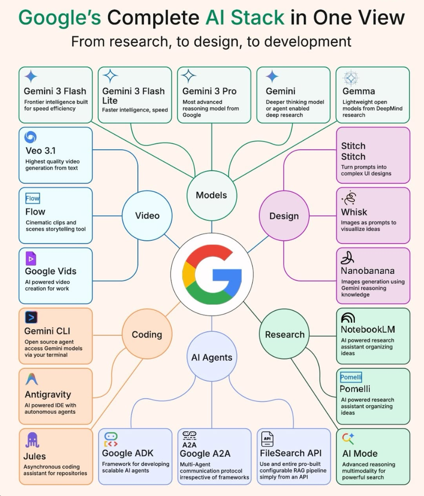
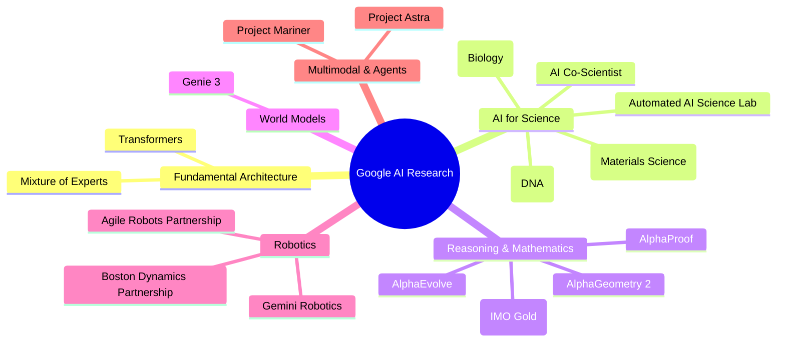

# Google AI Products

## Google's Complete AI Stack

## Models
Google's language model ecosystem is divided primarily between their flagship frontier models (Gemini) and their open-weight models (Gemma). Both families are natively multimodal, trained from the ground up to understand text, image, audio, and video.

### Gemini Family

The Gemini models are Google's proprietary frontier models, available through the [Gemini API](https://ai.google.dev/gemini-api/docs/models), [AI Studio](https://aistudio.google.com/), and [Vertex AI](https://cloud.google.com/vertex-ai).

| Model | Key Specs | Strengths | Best For |
|---|---|---|---|
| **Gemini 3.1 Pro** | 1M token context, 65K token output | 2x+ reasoning boost over Gemini 3 Pro. Flagship model for complex problem-solving, coding, and deep analysis. | Analyzing entire codebases, hour-long videos, complex multi-step reasoning, large document processing. |
| **Gemini 3.1 Flash Live** | Sub-500ms first-byte latency, 90+ languages | Native audio-to-audio processing (no transcribe-synthesize pipeline). Supports interruption handling, bidirectional streaming, and parallel video + tool use. | Real-time voice assistants, live translation, interactive tutoring, conversational AI. |
| **Gemini 3.1 Flash-Lite** | Fastest throughput, lowest cost | Most budget-friendly model in the lineup. Designed for heavy workloads at minimal cost. | High-volume classification, content filtering, RAG pipelines, batch processing. |
| **Gemini 3 Deep Think** | Extended reasoning mode | Blends deep scientific knowledge with engineering utility. Achieved gold-medal performance on IMO (5/6 problems, 35 points). 90% on IMO-ProofBench, 84.6% on ARC-AGI-2. | Scientific research, formal proofs, competitive programming, complex mathematical reasoning. |
| **Gemini 2.5 Pro** | Previous generation, still active | Mature and well-tested. Good balance of capability and cost. | General-purpose tasks where 3.1 features aren't needed. |
| **Gemini 2.5 Flash** | Previous generation, cost-efficient | Starting point for most teams. Supports Deep Think reasoning mode and thinking budgets. | Cost-sensitive applications, prototyping, development. |
| **Gemini 2.5 Flash-Lite** | Most cost-efficient in 2.5 series | Lowest price point for production workloads. | Budget applications at scale. |

> **Note:** Gemini 1.5 Pro and 1.5 Flash are now legacy models. While still accessible, they are superseded by the 2.5 and 3.x series across all capabilities.

**Comparison:** Gemini 3.1 Pro competes directly with Anthropic's Claude Opus 4.6 and OpenAI's GPT-5. Google's distinct advantages are the massive 1M-token context window, native video frame processing, and the Deep Think reasoning mode. Flash Live is unique in offering sub-500ms real-time audio with no equivalent from competitors at that latency.

*Additional Reading: [Gemini API Model Documentation](https://ai.google.dev/gemini-api/docs/models) · [Gemini 3.1 Pro Model Card](https://deepmind.google/models/model-cards/gemini-3-1-pro/) · [Deep Think Blog Post](https://deepmind.google/blog/accelerating-mathematical-and-scientific-discovery-with-gemini-deep-think/)*

### Gemma Family

Open-weight models built from the same research as Gemini. All released under the **Apache 2.0** license for free commercial and research use. Available on [Kaggle](https://www.kaggle.com/models/google/gemma) and [Hugging Face](https://huggingface.co/google/gemma).

| Model | Parameters | Key Features | Best For |
|---|---|---|---|
| **Gemma 4** (April 2026) | E2B, E4B, 26B MoE, 31B Dense | Multimodal across all sizes (images + video). Native audio input on E2B and E4B. CodeGemma capabilities now integrated. | Local deployments, embedded applications, edge devices, private AI, code generation. |
| **Gemma 3** (March 2025) | 1B, 4B, 12B, 27B | 128K token context window (16x larger than Gemma 2). 140+ language support. 1B is text-only; larger sizes support images + text. | Multilingual applications, long-context tasks on consumer hardware. |
| **PaliGemma 2** | 3B, 10B, 28B | Specialized vision-language model replacing original PaliGemma. Multiple resolutions (224px, 448px, 896px). Out-of-the-box capability for common vision tasks. | Object detection, OCR, visual QA, image captioning, segmentation. |

> **Note:** The original Gemma 2, PaliGemma, and standalone CodeGemma models are still available but superseded by Gemma 4 and PaliGemma 2.

**Comparison:** Gemma 4 competes with Meta's Llama 3.x, Mistral's open models, and Microsoft's Phi family. Gemma's advantages are native multimodality at all sizes (including audio on smaller variants) and the direct lineage from Gemini research. The 26B MoE variant offers an excellent performance-per-FLOP ratio.

*Additional Reading: [Gemma 4 Announcement](https://blog.google/innovation-and-ai/technology/developers-tools/gemma-4/) · [Gemma Documentation](https://ai.google.dev/gemma/docs/core) · [PaliGemma 2](https://deepmind.google/models/gemma/paligemma-2/)*

## Research
Google's research wing has historically driven many of the fundamental breakthroughs in modern AI, notably the invention of the Transformer architecture ("Attention Is All You Need," 2017). Google DeepMind — formed in 2023 by merging DeepMind and Google Brain — continues to push the frontier across science, mathematics, and AI systems.

### Research Pillars

### Key Research Projects

- **AlphaFold 3:** Predicts 3D structures of proteins, DNA, RNA, small molecules, and ions in a single pass with 76% accuracy on ligand binding poses. Used by over 3 million scientists in 190+ countries. Pharmaceutical companies like Eli Lilly and Novartis use it to screen thousands of molecules before lab synthesis.
  - *Additional Reading: [AlphaFold 3 Paper (Nature)](https://www.nature.com/articles/s41586-024-07487-w) · [AlphaFold Database](https://alphafold.ebi.ac.uk/)*

- **AlphaEvolve:** A Gemini-powered coding agent that pairs LLMs with evolutionary algorithms to discover novel algorithms and optimize existing ones. Deployed internally at Google for over a year — recovered 0.7% of Google's worldwide computing resources and sped up a key Gemini training kernel by 23%.
  - *Additional Reading: [AlphaEvolve Blog](https://deepmind.google/blog/)*

- **Genie 3:** An 11-billion-parameter interactive world model that generates navigable 3D environments at 720p resolution, 24fps from text prompts. Unlike video generators (Sora, Runway), Genie creates dynamically simulated worlds with real-time user interaction. Available to Google AI Ultra subscribers in the U.S.
  - *Additional Reading: [Genie 3 Blog](https://deepmind.google/blog/genie-3-a-new-frontier-for-world-models/)*

- **AI Co-Scientist:** A multi-agent AI system acting as a virtual scientific collaborator. Has proposed novel drug repurposing candidates for liver fibrosis (validated in labs) and predicted antimicrobial resistance mechanisms.

- **AlphaGenome:** An AI model designed to help understand DNA sequences. Part of an enhanced access program for UK scientists.

- **Automated AI Science Lab:** DeepMind's first fully automated laboratory in the UK, focused on materials science. Uses world-class robotics to synthesize and characterize hundreds of materials per day, fully integrated with Gemini.

- **Gemini Robotics:** Foundation models for robotics combining multimodal reasoning with physical world understanding. Active partnerships with **Boston Dynamics** (humanoid robots for manufacturing, announced January 2026) and **Agile Robots** (next-generation AI robotics, March 2026).
  - *Additional Reading: [Gemini Robotics](https://deepmind.google/models/gemini-robotics/) · [Boston Dynamics Partnership](https://bostondynamics.com/blog/boston-dynamics-google-deepmind-form-new-ai-partnership/)*

- **GraphCast:** Generates 10-day global weather forecasts more accurately than traditional physics simulations, in minutes rather than hours.

- **GNoME (Graph Networks for Materials Exploration):** Discovered millions of new theoretically stable materials for advanced batteries, solar cells, and superconductors.

- **Aletheia:** An autonomous research system for algorithm discovery. Producing "publishable quality" research being submitted to reputable journals, including new matrix multiplication algorithms.

*Additional Reading: [Google DeepMind Research](https://deepmind.google/discover/) · [2025 Year in Review](https://deepmind.google/blog/googles-year-in-review-8-areas-with-research-breakthroughs-in-2025/)*

## Video
Google leads in combining AI video generation with native video comprehension, offering the full pipeline from creation to understanding.

- **Veo 4** (April 2026): Google's most advanced text-to-video model. Supports storyboard-driven generation and produces 10–30 seconds of high-quality video.
  - **Strengths:** Highest realism and prompt adherence in the Veo family. Storyboard capability enables multi-shot narrative control.
  - **When to use:** Prototyping film sequences, generating hero-quality video content.

- **Veo 3.1 Family:** Production-grade video generation available through the [Gemini API](https://ai.google.dev/) and [AI Studio](https://aistudio.google.com/):
  - **Veo 3.1** — Highest quality, native 4K resolution, built-in audio generation (sound effects, dialogue, ambient noise).
  - **Veo 3.1 Fast** — Faster inference for iterative workflows.
  - **Veo 3.1 Lite** — Less than 50% the cost of Fast at the same speed. Ideal for high-volume generation.
  - **Strengths:** Native audio generation is unique — competitors require separate audio models. Vertical video support for social media formats.
  - **When to use:** Marketing content, social media, B-roll, rapid prototyping.

- **Google Vids:** Free AI video creation tool integrated into Google Workspace. Combines Veo 3.1 for video, Lyria 3 for custom music, and avatar control for presentations. 10 free generations per month.
  - **When to use:** Business presentations, internal communications, training videos.

- **Gemini Video Understanding:** Because Gemini is natively multimodal, you can upload hours of video and ask highly specific questions (e.g., "At 12:04, what color is the passing car?" or "Summarize the key arguments made in this 2-hour meeting").
  - **Strengths:** No other model matches the combination of long-context video + natural language Q&A at this scale.

**Comparison:** Veo 4 competes against OpenAI's Sora, Runway Gen-3, and Kling. Veo's distinct advantages are native audio generation (competitors require separate audio pipelines), Google's YouTube-trained realism, and the integrated Workspace experience through Google Vids.

*Additional Reading: [Veo Overview](https://deepmind.google/technologies/veo/) · [Veo 3.1 Lite Announcement](https://blog.google/innovation-and-ai/technology/ai/veo-3-1-lite/) · [Google Vids](https://blog.google/products-and-platforms/products/workspace/google-vids-updates-lyria-veo/)*

## Agents
Agents are AI systems capable of perceiving environments, reasoning dynamically, and taking iterative steps to achieve goals. Google has invested heavily in both consumer-facing agent experiences and enterprise agent infrastructure.

- **Project Astra:** A universal AI agent built to process real-time multimodal inputs — voice, video, and text simultaneously.
  - **Example:** A user points their smartphone camera around a room, and Astra identifies objects, acts as a real-time conversational tutor, and remembers where it saw items. It can provide step-by-step instructions for complex physical tasks.
  - **Strengths:** Extreme low-latency, real-time voice and vision capabilities. Persistent memory across interactions.
  - **What's New:** Expanding beyond smartphones to **Android XR smart devices** (Project Moohan partnership), bringing always-on AI assistance to wearable form factors.
  - *Additional Reading: [Project Astra](https://deepmind.google/technologies/project-astra/)*

- **Project Mariner:** An AI web browsing agent that can autonomously navigate websites, fill forms, extract information, and complete multi-step web tasks.
  - **Example:** "Find the cheapest round-trip flight from SFO to Tokyo in July, filtering for direct flights only" — Mariner navigates airline sites, applies filters, and compiles results.
  - **Strengths:** Built on Gemini 2.0's multimodal understanding. Can see and interact with web UIs like a human.
  - *Additional Reading: [Project Mariner](https://deepmind.google/models/project-mariner/)*

- **Agent Development Kit (ADK):** An open-source framework launched mid-2025 that democratizes agent development. Enables third-party developers to build specialized "Astra-like" agents for niche industries (healthcare, construction, legal).
  - **When to use:** Building custom agents that need tool use, memory, and multi-step reasoning on top of Gemini models.

- **Vertex AI Agent Builder:** Enterprise platform for building and deploying agents at scale:
  - **Agent Designer** — Low-code visual designer for creating agent workflows (Preview).
  - **Agent Engine Sessions & Memory Bank** — Persistent state management for production agents (GA).
  - **Enhanced Tool Governance** — Fine-grained control over which tools agents can access and when.
  - *Additional Reading: [Vertex AI Agent Builder](https://cloud.google.com/products/agent-builder)*

**Comparison:** Google's agent ecosystem is broader than competitors' — spanning consumer (Astra, Mariner), developer (ADK), and enterprise (Vertex AI Agent Builder). OpenAI's agent offerings are more focused on API-level tool use, while Anthropic's Claude focuses on computer use within desktop environments.

*Additional Reading: [Google AI Agents Overview](https://blog.google/innovation-and-ai/technology/ai/google-ai-updates-march-2026/)*

## Coding
Google brings massive context windows and autonomous coding agents to the software development lifecycle.

- **Gemini Code Assist:** Enterprise IDE plugin for VS Code, JetBrains, and Android Studio.
  - **Strengths:** Can analyze your *entire* codebase at once due to the 1M+ token context window. Now powered by Gemini 2.5+. Free for individual developers (as of March 2026). Features include code completions, function generation from comments, unit test generation, and debugging assistance.
  - **Weaknesses:** Smaller third-party extension ecosystem compared to GitHub Copilot. Enterprise features require Google Cloud subscription.
  - **When to use:** Sweeping refactors, explaining how deeply nested microservices interact, repository-wide code reviews.
  - *Additional Reading: [Gemini Code Assist](https://codeassist.google/) · [Code Assist Docs](https://cloud.google.com/products/gemini/code-assist)*

- **Jules:** An experimental AI code agent powered by Gemini 3 Pro.
  - **How it works:** Jules clones your GitHub repository to a Cloud VM, develops an execution plan for the requested changes, and implements them autonomously. You review and merge the results.
  - **Strengths:** Fully autonomous — handles multi-file changes, runs tests, and creates pull requests. Deep GitHub integration.
  - **Weaknesses:** Still experimental. Best for clearly-articulated, well-scoped tasks rather than open-ended exploration.
  - **When to use:** Bug fixes across multiple files, dependency upgrades, boilerplate generation, migration tasks.
  - *Additional Reading: [Jules](https://jules.google/)*

> **Note:** CodeGemma (the standalone code-specialized model) is now integrated into **Gemma 4**. For local/private code generation, use Gemma 4 directly.

**Comparison:** Gemini Code Assist competes with GitHub Copilot, Anthropic's Claude Code, and Cursor. The 1M-token context window remains Google's primary differentiator for repository-wide tasks. Jules competes with GitHub Copilot Workspace and similar autonomous coding agents.

## Design
Google offers powerful proprietary tools for AI-driven visual design and image generation.

- **Imagen 4:** Google's highest-quality text-to-image model, generally available since February 2026 through the [Gemini API](https://ai.google.dev/) and [AI Studio](https://aistudio.google.com/).
  - **Strengths:** Up to 2K resolution output. Incredible photorealism, strict adherence to complex prompts, and unmatched ability to render accurate text naturally within an image. **SynthID** invisible watermarking for content provenance.
  - **Weaknesses:** Safety guardrails can over-filter benign prompts compared to open-source counterparts (Stable Diffusion, Flux).
  - **When to use:** Commercial imagery, product mockups, marketing materials, social media content.
  - **Imagen 4 Fast:** A 10x faster variant at $0.02 per output image, ideal for high-volume generation and rapid iteration.
  - *Additional Reading: [Imagen 4 Documentation](https://docs.cloud.google.com/vertex-ai/generative-ai/docs/models/imagen/4-0-generate) · [Imagen Overview](https://deepmind.google/models/imagen/)*

**Comparison:** Imagen 4 competes against Midjourney, DALL-E, and Flux. Imagen 4 surpasses DALL-E in photorealism and text rendering accuracy. The Fast variant makes it the most cost-effective option for production workloads at scale. SynthID watermarking provides unique content authenticity features.

## NotebookLM
[NotebookLM](https://notebooklm.google/) is Google's source-grounded AI research and note-taking tool. Unlike general chatbots, every answer is tied directly to the documents you upload — reducing hallucination and ensuring traceability.

- **Strengths:** Powered by Gemini 3 models. Supports PDFs, Google Docs, Google Slides, web URLs, YouTube videos, audio files, and EPUB uploads. All responses cite specific passages from your sources.
- **Weaknesses:** Quality is bounded by the quality of uploaded sources. Limited to supported formats. No real-time web access — only works with uploaded/linked materials.
- **Key Features:**
  - **Audio Overviews** — Generates podcast-style discussions about your content with two AI hosts. Customizable length and focus.
  - **Video Overviews** — AI-generated video summaries with narration and visuals.
  - **Cinematic Videos** — Immersive deep-dive videos with fluid animations for visualizing complex narratives.
  - **Study Tools** — Progress-saving flashcards and quizzes with "Got it" / "Missed it" tracking.
  - **10 Infographic Styles** — Sketch Note, Kawaii, Professional, Scientific, Anime, Clay, Editorial, Instructional, Bento Grid, Bricks.
- **When to use:** Literature reviews, exam preparation, turning research papers into audio summaries, team knowledge sharing, onboarding documentation.
- **Example:** Upload 5 research papers on a topic → generate an Audio Overview to listen during a commute → use Study Tools to quiz yourself on key findings.

**Comparison:** Competes with tools like Elicit and Consensus for research, but NotebookLM is unique in offering multimodal output (audio, video, infographics) rather than just text summaries. It's free to use.

*Additional Reading: [NotebookLM](https://notebooklm.google/) · [NotebookLM Updates (March 2026)](https://workspaceupdates.googleblog.com/2026/03/new-ways-to-customize-and-interact-with-your-content-in-NotebookLM.html)*

## Music

- **Lyria 3 Pro:** Google's AI music generation model. Generates complete tracks up to 3 minutes long with granular control over structure (intros, verses, bridges, outros). All output includes **SynthID** watermarking for provenance tracking.
  - **Strengths:** Integrated directly into Google Vids for free custom music generation. Granular compositional control beyond simple text-to-music.
  - **When to use:** Background music for videos, podcast intros, presentation soundtracks, creative prototyping.
  - *Additional Reading: [Lyria in Google Vids](https://blog.google/products-and-platforms/products/workspace/google-vids-updates-lyria-veo/)*

## AI in Search
Google has deeply integrated AI into its core Search product, fundamentally changing how billions of users discover information.

- **AI Overviews:** AI-generated summaries displayed at the top of search results. Used by over 1 billion people monthly. Powered by Gemini 3, with Gemini 2.0 activated for harder queries (coding, advanced math, multimodal).
  - **Impact:** Now appears in 30–45% of informational searches (health, finance, SaaS, ecommerce).

- **AI Mode** (January 2026): A conversational search experience accessible from AI Overviews. Users can tap into a deeper chat-style exploration of any topic, with follow-up questions and multi-turn reasoning.
  - **Example:** Search for "best laptop for video editing" → AI Overview gives a summary → tap into AI Mode to ask "what if my budget is under $1,500 and I need Thunderbolt 4?"

- **Gemini Canvas:** An interactive workspace within Search for planning, writing, and creating. Enables iterative collaboration with AI directly in the search interface.

*Additional Reading: [AI Mode Announcement](https://blog.google/products/search/ai-mode-search/) · [AI Overviews Updates](https://blog.google/products/search/ai-mode-ai-overviews-updates/)*

## Workspace AI
Gemini is deeply integrated across Google Workspace, bringing AI assistance to billions of users in their daily productivity tools.

- **Gemini in Docs:** Drafting, rewriting, summarizing, and extending documents. "Help me write" generates full drafts from prompts.
- **Gemini in Sheets:** Data analysis, formula generation, chart creation, and natural-language queries against spreadsheet data. Described as "state-of-the-art performance for complex data analysis."
- **Gemini in Slides:** Automatic presentation generation from prompts, image creation, speaker notes, and layout suggestions.
- **Gemini in Drive:** Search and summarize across all files in your Drive. Ask questions like "What were the key decisions from last quarter's planning docs?"
- **Ask Maps:** A conversational experience answering complex location questions and booking reservations directly within Google Maps.
- **Personal Intelligence:** Free for all Gemini users in the U.S. Connects Gmail, Photos, and YouTube to help plan vacations, manage projects, and surface relevant personal information.

**Comparison:** Competes with Microsoft 365 Copilot. Google's advantage is the native integration across Search, Maps, and YouTube alongside traditional productivity tools. Microsoft's advantage is deeper enterprise administration and Teams integration.

*Additional Reading: [Gemini in Workspace](https://blog.google/products-and-platforms/products/workspace/gemini-workspace-updates-march-2026/)*

## Additional Resources

### Companies

#### Google DeepMind
- **Overview:** Formed in 2023 by merging the original DeepMind (acquired 2014) with Google Brain. Led by Demis Hassabis (2024 Nobel Prize in Chemistry for AlphaFold).
- **Strengths:** World-leading applied reinforcement learning, AI for science, and reasoning systems. Famous for mastering complex environments through self-play (AlphaGo defeating the world champion in Go, AlphaZero mastering chess/shogi/Go from scratch).
- **When to use:** Crucial when conceptualizing systems involving rigorous search algorithms, reinforcement learning, scientific discovery, or robotics.
- **Comparison:** Unlike organizations focused primarily on consumer LLMs, DeepMind has a rich legacy of bridging AI with the hard sciences — biology (AlphaFold), mathematics (AlphaProof), materials science (GNoME), and weather (GraphCast).

*Additional Reading: [Google DeepMind](https://deepmind.google/) · [DeepMind Blog](https://deepmind.google/blog/)*

### Products

#### Open Source
Google is a foundational contributor to open-source AI infrastructure.

- **JAX:** A highly optimized numeric computing library emphasizing functional programming and composable transformations (grad, jit, vmap, pmap). Now the **primary framework** at Google DeepMind for training frontier models. Ideal for large-scale ML research and high-performance training.
  - *Additional Reading: [JAX on GitHub](https://github.com/google/jax)*

- **Keras 3.0:** Completely re-architected as a **multi-backend** library. Can execute interchangeably on TensorFlow, PyTorch, or JAX. Ships with implementations of BERT, RoBERTa, GPT-2, Llama, Gemma, and Mistral — all runnable across any backend.
  - *Additional Reading: [Keras Documentation](https://keras.io/)*

- **TensorFlow:** The original massive ML ecosystem. Has evolved toward a "deployment-first" focus — strong support for TensorFlow Lite (mobile/edge), TensorFlow.js (browser), and TensorFlow Serving (production inference). Still widely used in production but largely superseded by JAX for cutting-edge research.
  - *Additional Reading: [TensorFlow](https://www.tensorflow.org/)*

**Comparison:** PyTorch remains dominant in academic research. JAX is the choice for Google's own frontier model training. Keras 3.0's multi-backend approach is unique — write once, run on any framework. TensorFlow maintains the strongest deployment story across mobile, browser, and edge devices.

*Additional Reading: [Google Open Source](https://opensource.google/)*

### Cloud & Infrastructure

- **AI Studio:** Google's free, web-based IDE for prototyping with Gemini models. Separated from Google Cloud billing in January 2026 for easier access. Default model is Gemini 3 Flash. Supports one-click deployment to Google Cloud Run.
  - *Additional Reading: [AI Studio](https://aistudio.google.com/)*

- **Vertex AI:** Google Cloud's enterprise ML platform. Includes model training, fine-tuning, deployment, evaluation, and the Agent Builder suite. Supports both Google models and third-party models (Anthropic, Meta, Mistral).
  - *Additional Reading: [Vertex AI](https://cloud.google.com/vertex-ai)*

- **TPU Infrastructure:** Google's custom Tensor Processing Units power Gemini training and inference. Available to Cloud customers for training custom models at scale.

---

#google #ai #gemini #gemma #deepmind #design #coding #video #music #agents #research #opensource #notebooklm #workspace #search
