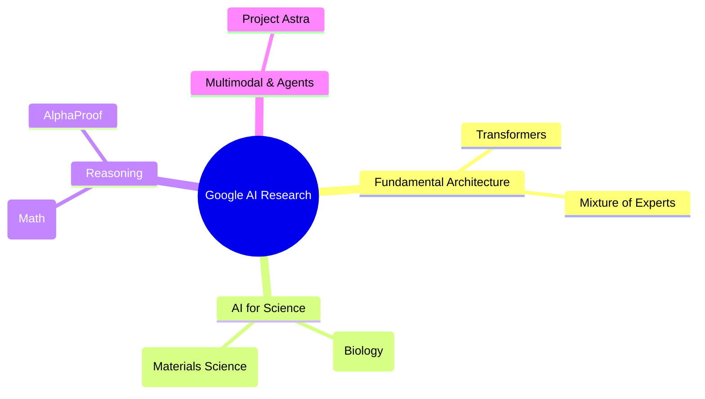

## Google's Complate AI Stack

## Models
Google's language model ecosystem is divided primarily between their flagship frontier models (Gemini) and their open-weight models (Gemma).

### Gemini Family
The Gemini models are natively multimodal, meaning they were trained from the ground up to understand text, image, audio, and video inputs without separate transcription models.

| Model | Strengths | Weaknesses | Best Used For |
|---|---|---|---|
| **Gemini 1.5 Pro** | Incredible 2-million token context window, sophisticated coding and reasoning abilities. | Slower generation speed. | Analyzing huge codebases, hour-long videos, complex reasoning. |
| **Gemini 1.5 Flash** | Extremely fast and cost-effective, while retaining a 1-million token context window. | Less capable at complex logical reasoning natively compared to Pro. | High-volume applications, retrieval augmented generation (RAG). |

**Comparison:** Gemini 1.5 Pro competes directly with OpenAI's GPT-4o and Anthropic's Claude 3.5 Sonnet. Gemini's distinct advantage is the massive context window and native video frame processing.

### Gemma Family
Open-weights models built from the same research as Gemini.

| Model | Strengths | Best Used For |
|---|---|---|
| **Gemma 2** (9B/27B) | Highly performant for their size, capable of running on consumer hardware. | Local, private deployments and embedded applications. |
| **PaliGemma** | Specialized vision-language model. | Object detection, visual QA. |

*Additional Reading: [Google Gemini Documentation](https://deepmind.google/technologies/gemini/)*

## Research
Google's research wing has historically driven many of the fundamental breakthroughs in modern AI, notably the invention of the Transformer architecture.

### Research Pillars

Google prioritizes using AI to solve hard physical and scientific problems.

*Additional Reading: [Google DeepMind Research](https://deepmind.google/discover/)*

## Video
Google leads the pack in combining native AI video generation and video comprehension.

- **Veo:** Google's latest text-to-video model.
  - **Strengths:** Generates highly realistic, 1080p, physics-aware videos from text, image, or video prompts. Features cinematic control over panning and dollying.
  - **Weaknesses:** Still restricted to limited access programs compared to some competitors.
  - **When to use:** Prototyping film shots, generating high-quality B-roll, visual effects.
- **Gemini Video Understanding:** 
  - **Strengths:** Because Gemini is natively multimodal, you can upload hours of video and ask highly specific questions (e.g., "At 12:04, what color is the passing car?").
  
**Comparison:** Veo competes against OpenAI's Sora and Runway Gen-3. Veo leverages Google's vast YouTube dataset for unparalleled physical realism.

*Additional Reading: [Google Veo Overview](https://deepmind.google/technologies/veo/)*

## Agents
Agents are AI systems capable of perceiving environments, reasoning dynamically, and taking iterative steps to achieve goals.

- **Project Astra:** A universal AI agent built to process real-time multimodal inputs. 
  - **Example:** A user points their smartphone camera around a room, and Astra can identify objects, act as a real-time conversational tutor, and remember where it saw items.
  - **Strengths:** Extreme low-latency, real-time voice and vision capabilities.
- **Vertex AI Agents:** Enterprise toolsets allowing developers to build specialized agents natively integrated into Google Cloud infrastructure and external APIs.

*Additional Reading: [Project Astra Information](https://deepmind.google/technologies/project-astra/)*

## Coding
Google brings massive context windows to the software development lifecycle.

- **Gemini Code Assist:** Enterprise IDE plugin.
  - **Strengths:** Can analyze your *entire* codebase at once due to the 2-million token context window. This makes it uniquely good at sweeping refactors or explaining how deeply nested microservices interact.
  - **Weaknesses:** Smaller third-party extension ecosystem compared to GitHub Copilot.
- **CodeGemma:** A specialized version of the Gemma architecture fine-tuned entirely for programming. Open-weight and built for low-latency local execution.

**Comparison:** Vies against GitHub Copilot and Anthropic's Claude. The context window remains Google's primary differentiator for repository-wide tasks.

*Additional Reading: [Gemini Code Assist Docs](https://cloud.google.com/products/gemini/code-assist)*

## Design
Google has developed powerful proprietary tools for visual design.

- **Imagen 3:** Google's highest-quality text-to-image foundation model.
  - **Strengths:** Incredible photorealism, strict adherence to complex prompts, and unmatched ability to render accurate text naturally within an image.
  - **Weaknesses:** Safety guardrails often over-filter benign prompts compared to open-source counterparts.
  - **When to use:** Generating commercial imagery, product mockups, and integrating directly into Google Workspace tools.

**Comparison:** Competes against Midjourney v6 and DALL-E 3. Imagen 3 surpasses DALL-E in photorealism and closely matches Midjourney.

*Additional Reading: [Imagen 3 Details](https://deepmind.google/technologies/imagen-3/)*

## Additional Resources

### Companies

#### DeepMind
- **Overview:** Acquired by Google in 2014, DeepMind merged with Google Brain in 2023 to form **Google DeepMind**.
- **Strengths:** World-leading applied reinforcement learning. Their systems are famous for mastering complex environments through self-play (e.g., AlphaGo defeating the world champion in Go).
- **When to use:** Crucial when conceptualizing systems involving rigorous search algorithms, reinforcement learning, or scientific discovery. 
- **Comparison:** Unlike organizations focused primarily on consumer LLMs, DeepMind has a rich legacy of bridging AI with the hard sciences.

*Additional Reading: [DeepMind Official Site](https://deepmind.google/)*

### Products

#### Open Source
Google is a foundational contributor to open-source AI infrastructure.

- **TensorFlow:** The original massive machine learning ecosystem, providing an end-to-end platform for deploying models across edge devices and servers.
- **JAX:** A highly optimized numeric computing library emphasizing functional programming; currently widely adopted by frontier AI researchers.
- **Keras:** A high-level neural networks API running seamlessly on top of TensorFlow or JAX for rapid iteration.

**Comparison:** PyTorch has largely overtaken TensorFlow in pure research settings, but JAX is rapidly gaining ground for training the next generation of massive models.

*Additional Reading: [Google Open Source](https://opensource.google/)*

### Research

*   **Biology:** **AlphaFold 3**, which predicts the structure and interactions of life's complex molecules (proteins, DNA, RNA).
*   **Meteorology:** **GraphCast**, a model generating 10-day global weather forecasts more accurately than traditional physics simulations.
*   **Mathematics:** **AlphaGeometry** and **AlphaProof**, systems capable of solving rigorous Olympiad-level geometric and mathematical proofs.
*   **Materials Science:** **GNoME** (Graph Networks for Materials Exploration), discovering millions of new theoretical materials for advanced batteries.
*   **Robotics:** **RT-X**, aiming to provide generalized foundation models for robotic control.

---
#google #ai #gemini #deepmind #design #coding #video #agents #research #opensource 